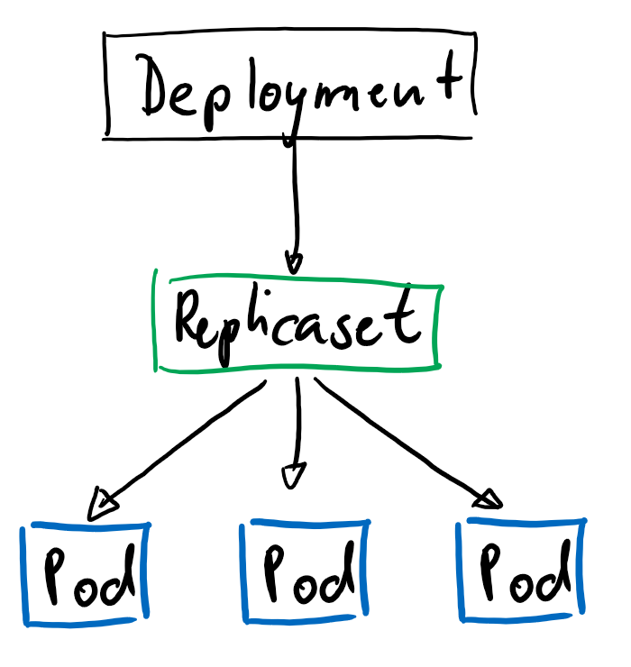
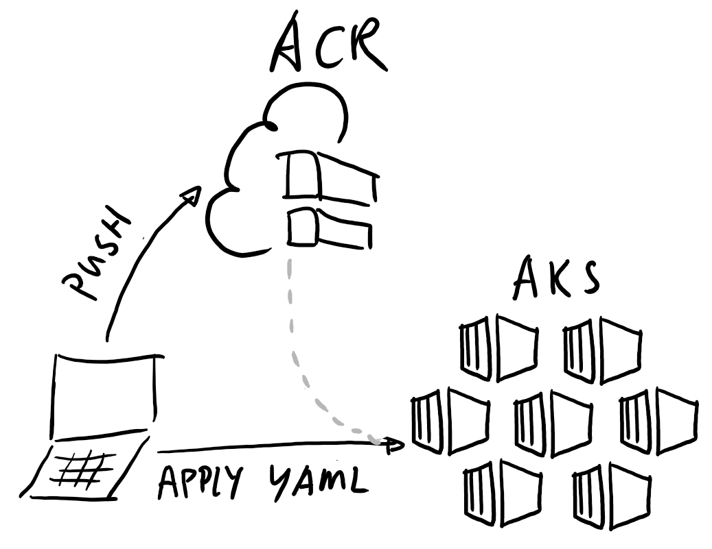
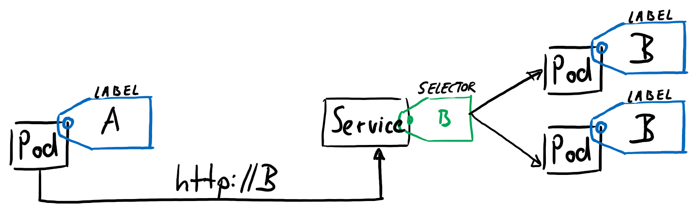
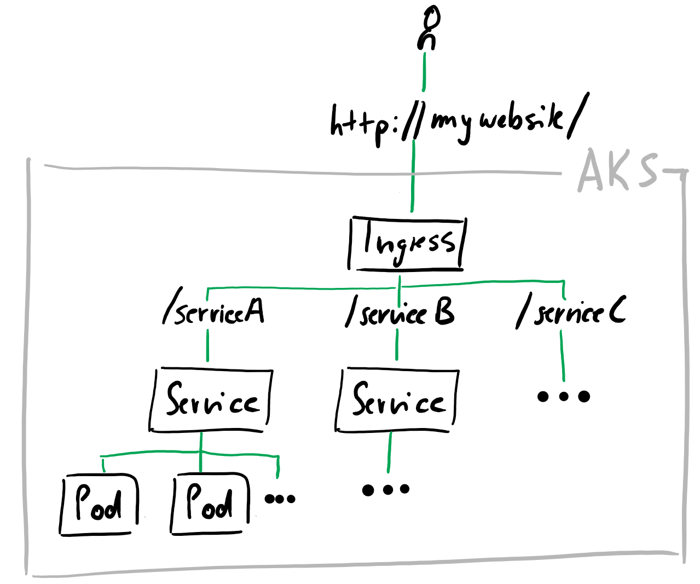

# K8s Hands-on 🚢
Here, a random introduction will find its place. Probably I will link the ppt in addition.
> This guided hands-on workshop was tested with AKS 1.12.8.  

> This workshop is accompanied by an instructor and additional slides.
# Prerequisite
> Alternatively you can use http://shell.azure.com
* Install the Kubernetes command line interface: [kubectl](https://kubernetes.io/docs/tasks/tools/install-kubectl/ "https://kubernetes.io/docs/tasks/tools/install-kubectl/")
* Install [Azure CLI](https://docs.microsoft.com/de-de/cli/azure/install-azure-cli?view=azure-cli-latest "https://docs.microsoft.com/de-de/cli/azure/install-azure-cli?view=azure-cli-latest")
* Install the Azure Kubernetes Service command line interface by using the following command
```powershell
az aks install-cli
```
# Switch to needed Azure subscription
First, check which subscriptions are available. Use the `--refresh` flag since the list is cached.
````powershell
az account list --refresh
````
Set the context of the needed subscription. You can either use the name or ID.
```powershell
az account set --subscription <SUBSCRIPTION>
```
# Create an AKS Cluster 
Create a resource group and the AKS cluster. Another resource group will automatically be built during the create process. In the second resource group you will find the infrastructure like virtual machines.
```powershell
az group create --name <RESOURCEGROUP> --location <LOCATION>
```
```powershell
az aks create `
    --resource-group <RESOURCEGROUP> `
    --name <CLUSTERNAME> `
    --node-count 1 `
    --enable-addons monitoring `
    --generate-ssh-keys
```
# Connect to cluster 🔌
You can connect to any azure cluster by downloading the credentials.
```
az aks get-credentials --resource-group <RESOURCEGROUP> --name <CLUSTERNAME>
```
To verify if you are successfully connected open the config.
```
kubectl config get-contexts
```
Finally, get information about your running nodes.
```powershell
kubectl get nodes
```
# Kubernetes 101 - the imperative way 🔨
## Deploy a cached image
One of the available precached images is a nginx image. Run it with the following command.
```powershell
kubectl run nginx --image=nginx --replicas=3
```
This command will result in a *deployment* which is related to a *replicaset*. The *replicaset* is responsible for 3 copies of the *pod* where the images lives in.  
<p align="center">
  
</p>

Check if 3 pods are running.
```powershell
kubectl get pods
```
Create a tunnel while using port forwarding. You should see the welcome site of a nginx deployment when you open `http//:localhost`.
```powershell
kubectl port-forward <NAME_OF_POD> 80:80
```
The kubectl run command created a deployment as shown above. Start editing it and analyze the code.
```powershell
kubectl get deployment
```
```powershell
kubectl edit deployment <NAME_OF_DEPLOYMENT>
```
In the deployment yaml it says `replicas: 3`. Delete the pod to see the self-healing mechanism of kubernetes. To follow the whole process, open another terminal and call `kubectl get pods -w`. This will stream any changes.
```powershell
kubectl delete pod <NAME_OF_POD>
```
The pod will be recreated immediately since the replicaset of the deployment says that there should be 3 replicsa at any time. This is a huge thing since Kubernetes will always look for the healthiness of your applications. 
```powershell
kubectl get pods
```
So, if you actually want to delete the three nginx you have to delete the deployment. Do that and clean up.
```powershell
kubectl delete deployment nginx
```
# Kubernetes 101 - the declarative way (YAML) 📓🖊️
In the previous steps you deployed a precached image of nginx witch imperative commands. Now you will not be using just yaml to deploy the image in a declarative way but even use your own containerized application. To do so, you must push your application first to a container registry as shown in the picture below. Afterwards you can apply a yaml file directly to the cluster with a link of the image in the container registry.  
<p align="center">
  
</p>

## Create an Azure Container Registry
The Azure Container Registry (ACR) is a private image repository hosted on Azure.
Create an ACR by using the azure cli. For simplicity, we set the `--admin-enabled` flag to true to push an image directly from our command line to the ACR.
```powershell
az acr create -n <REGISTRY_NAME> -g <RESOURCE_GROUP_NAME> --sku Standard --admin-enabled true --location <LOCATION>
```
### Prepare the Cluster
Next, we will deploy own images by using yaml files. In these yaml files we will link an ACR. To enable the AKS to access the ACR we can add the privileges to the existing Service Principal (SP) which was created during the cluster creation. In case you do not have enough privileges to do so, we can create a Kubernetes secret. Review [this Microsoft Docs](https://docs.microsoft.com/de-de/azure/container-registry/container-registry-auth-aks "https://docs.microsoft.com/de-de/azure/container-registry/container-registry-auth-aks") to understand both ways.  

Replace the variables and run this powershell script to add the privileges to the existing SP.
```powershell
$AKS_RESOURCE_GROUP="<AKS_RESOURCE_GROUP>"
$AKS_CLUSTER_NAME="<AKS_CLUSTER_NAME>"
$ACR_RESOURCE_GROUP="<ACR_RESOURCE_GROUP>"
$ACR_NAME="ACR_NAME"
$CLIENT_ID=$(az aks show --resource-group $AKS_RESOURCE_GROUP --name $AKS_CLUSTER_NAME --query "servicePrincipalProfile.clientId" --output tsv)
$ACR_ID=$(az acr show --name $ACR_NAME --resource-group $ACR_RESOURCE_GROUP --query "id" --output tsv)
az role assignment create --assignee $CLIENT_ID --role acrpull --scope $ACR_ID
```
> Open the Azure portal and validate if you can see a `role assignment` from the AKS's SP under `Access control` of the ACR.
## Prepare the sample Node Application 📦
Checkout the `js-idrepater` which is in this GitHub repository.
Run the docker build command. Tag the image with the application's name (`js-idrepeater`) and set a version number like `1` or `v1`. Notice that we used the prefix `<ACR_NAME>.azurecr.io`. We need this prefix for the docker push command later. Do not forget the dot at the end.
```powershell
docker build -t <ACR_NAME>.azurecr.io/js-idrepeater:1 .
```
Test `js-idrepeater` locally. Do not forget to forward the machines port to the container port.
```powershell
docker run -p 80:80 <ACR_NAME>.azurecr.io/js-idrepeater:1
```
To validate that the application is running, open a browser and call the localhost. You will see a random four-digit key. This key is generated on startup of the container and will not change during the whole lifecycle of the container. To understand this behavior, kill the container and run it once again.
```
http://localhost:80
```
As we confirmed that the container is running we will push our image to our newly created ACR. First authenticate with the ACR.
```powershell
az acr login -n <ACR_NAME>
```
```powershell
docker push <ACR_NAME>.azurecr.io/js-idrepeater:1
```
Visit the ACR resource in the Azure portal to verify the upload. Look for `Repositories` in the menu and check if a repository with `js-idrepeater` was created.
## Deploy the `js-idrepeater` to your AKS Cluster 🚀
Next you will create a kubernetes deployment yaml. In the source tree of `js-idrepeater` create a folder named `manifests`. Inside, create a file and call it `deployment.yml`. If you stick to the provided names of the folder and files Azure DevOps can read these files automatically in a later exercise of this workshop.  

Please consider, that you have to point to the correct version of your image! For now you are good by taking `1`. Since we applied the privileges to access the ACR to the SP we are all good. If you had to create a Kubernetes secret before please use it now as an `imagePullSecrets`. Place it like this `spec.template.spec.imagePullSecrets`.
```yaml
apiVersion : apps/v1beta1
kind: Deployment
metadata:
  name: js-idrepeater 
spec:
  replicas: 2
  template:
    metadata:
      labels:
        app: js-idrepeater
    spec:
      containers:
        - name: js-idrepeater 
          image: <ACR_NAME>.azurecr.io/js-idrepeater:1
          ports:
          - containerPort: 80
```
> As we do not specify any namespace `default` is used  

Next, apply the `Deployment` to your kubernetes cluster.
```powershell
kubectl apply -f .\deployment.yml
```
Check if the deployment created your pod.
```powershell
kubectl get pods
```
Forward to this pod and call `http://localhost`.
```powershell
kubectl port-forward <NAME_OF_POD> 80:80
```
## Self testing 💉
The cluster will immediately recreate a pod if a container / pod crashes. But that way you do not validate if the application inside the container is still running. Therefore, you can specify in any deployment yaml a liveness probe. The following liveness probe is calling the API `healthz` with a initial delay of three seconds.  
> The node application will spin up in three seconds. But always consider that some applications will take longer.
```yaml
livenessProbe:
  httpGet:
    path: /healthz
    port: 80
  initialDelaySeconds: 3
  periodSeconds: 3
```
The full deployment yaml will look like the following. Use `kubectl apply -f <FILENAME>` to deploy it.
```yaml
apiVersion : apps/v1beta1
kind: Deployment
metadata:
  name: js-idrepeater 
spec:
  replicas: 2
  template:
    metadata:
      labels:
        app: js-idrepeater
    spec:
      containers:
        - name: js-idrepeater 
          image: <ACR_NAME>.azurecr.io/js-idrepeater:1
          ports:
          - containerPort: 80
          livenessProbe:
              httpGet:
                path: /healthz
                port: 80
              initialDelaySeconds: 3
              periodSeconds: 3
```
# Kubernetes' service discovery 🔎
As you already noticed there are more than just one `js-idrepeater` `pod`. You need an abstraction layer which knows every `pod` no matter on which node it is running on. Other scenarios can be scale-out, recreation of a pod, scheduling pods to other nodes and all other cases in which pods might change their IP or count. The `service` is doing this job in Kubernetes. The `service` uses `selectors` which matches with `labels` in the pod yaml.
> Inspect the deployment.yaml file and find the `spec.template.metadata.labels.app` which is set to `js-idrepeater`. 
<p align="center">
  
</p> 

Create the file `service.yml` next to the deployment file. And apply it to AKS.
 ```yaml
apiVersion: v1
kind: Service
metadata:
    name: js-idrepeater
spec:
    ports:
    - port: 80 
    selector:
        app: js-idrepeater
```
```powershell
kubectl apply -f .\service.yml
```
Now, all pods of `js-idrepeater` are reachable through the service. Check if the service is running.
```powershell
kubectl get svc
```
Next, log on one of the running pods and call the another one by using the service.
```powershell
kubectl get pods
```
```powershell
kubectl exec -it <POD_NAME_NGINX> /bin/sh
```
```powershell
wget http://idrepeater
```
```powershell
cat index.html
```
# Exposing the service to the outside by assigning a LoadBalancer with IP
Edit the yaml of the service as follows. By default, the type of a service is ClusterIp and it is not needed to specify. We will change it to LoadBalancer. When you update the service with the new yaml file kubernetes will use the SP to create a IP and LoadBalancer. Afterwards a rule will be automatically defined which routes the traffic to the IP directly to the service in the AKS. 
 ```yaml
apiVersion: v1
kind: Service
metadata:
    name: js-idrepeater
spec:
    ports:
    - port: 80 
    selector:
        app: js-idrepeater
    type: LoadBalancer
```
```powershell
kubectl apply -f .\service.yml
```
It will take some time until the IP is scheduled.
```powershell
kubectl get svc -w
```
# Configure an Ingress 🛰️
Kubernetes is supporting the concept of an ingress. In the following we will use the standard nginx ingress but there are a lot of open source projects which offers much more value than just a reverse proxy. You will use `helm` to install the `nginx`.  

## Install helm
Helm is a package manager and can keep track of your deployments to e.g. roll back. Go to the release page and install helm.
```link
https://github.com/helm/helm/releases
```
Next, the local `Helm client` has to be connected to your cluster. By calling `helm init`, helm will install the `Tiller`. It is the server side of your package management system.
```powershell
helm init
```
Check the versions of your client and tiller.
```powershell
helm version
```
The `Tiller` needs privileges to install applications. Apply the following yaml with `kubectl apply -f <FILENAME>`
```yaml
apiVersion: v1
kind: ServiceAccount
metadata:
  name: tiller
  namespace: kube-system
---
apiVersion: rbac.authorization.k8s.io/v1
kind: ClusterRoleBinding
metadata:
  name: tiller
roleRef:
  apiGroup: rbac.authorization.k8s.io
  kind: ClusterRole
  name: cluster-admin
subjects:
  - kind: ServiceAccount
    name: tiller
    namespace: kube-system
```
Let your running `tiller` know about the privilege changes.
```powershell
helm init --service-account=tiller --upgrade
```
## Setup an ingress which works with basic http.
> For simplicity we will use a [basic http](https://docs.microsoft.com/en-us/azure/aks/ingress-basic "https://docs.microsoft.com/en-us/azure/aks/ingress-basic") configured nginx. Please consider to use [TLS secured](https://docs.microsoft.com/en-us/azure/aks/ingress-tls "https://docs.microsoft.com/en-us/azure/aks/ingress-tlsc") nginx deployments.  

The `Ingress` will be our reverse proxy.  
<p align="center">
  
</p>

```powershell
helm install stable/nginx-ingress `
    --set controller.replicaCount=1 `
    --set controller.nodeSelector."beta\.kubernetes\.io/os"=linux `
    --set defaultBackend.nodeSelector."beta\.kubernetes\.io/os"=linux
```
The command `helm ls` will show you all installed helm repositories. 
```powershell
helm ls
```
Check the running pods und services.
```powershell
kubectl get pods
```
```powershell
kubectl get svc
```
The exposed service of the nignx will show a 404 error since we just installed the nginx but did not tell where to route the traffic. To solve this we have to create an `ingress route` which points to our `service` of `js-idrepeater`.
```yaml
apiVersion: extensions/v1beta1
kind: Ingress
metadata:
  name: ingress-js-idrepeater
  annotations:
    kubernetes.io/ingress.class: nginx
    nginx.ingress.kubernetes.io/ssl-redirect: "false"
    nginx.ingress.kubernetes.io/rewrite-target: /$2
spec:
  rules:
  - http:
      paths:
      - backend:
          serviceName: js-idrepeater
          servicePort: 80
        path: /js-idrepeater      
```
